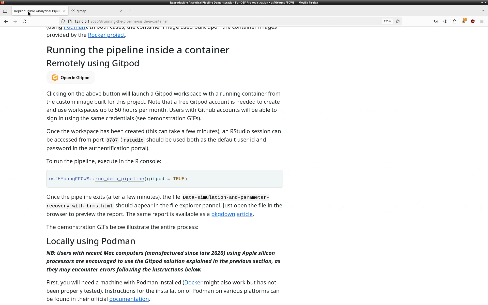

# Code and dependencies to run the demonstration pipeline

This repository is a companion to an 
[OSF pre-registration](https://osf.io/ygbsu). It is
organized as an R package and can be installed with:

```r
install.packages("devtools")
devtools::install_github("hugomell/osfHYoungFFCWS", dependencies = FALSE)
```

It provides R code to run a demonstration pipeline that:

1. simulates fake datasets based on the equations for the three 
   models described in the pre-registration

2. recovers the simulations' structural parameters with bayesian estimation
   using the `{brms}` package

3. generates an HTML report with lavaan syntax for the models used to generate
   fake data, histograms of the simulated variables, tables and posterior
   distributions for regression coefficients 

The report produced at the end of the pipeline is available as a 
`{pkgdown}` 
[article](https://hugomell.github.io/osfHYoungFFCWS/articles/Data-simulation-and-parameter-recovery-with-brms.html).
on the package's website.

In the next section, we explain how to run the pipeline in a isolated
container with all the required software dependencies already installed,
either remotely (using [Gitpod](https://gitpod.io)), or locally (using
[Podman](https://podman.io/)). In both cases, the container image used built
upon the container images provided by the 
[Rocker project](https://rocker-project.org/).


## Running the pipeline inside a container

### Remotely using Gitpod

[](https://gitpod.io/#https://github.com/hugomell/osfHYoungFFCWS/tree/gitpod)

Clicking on the above button will launch a Gitpod workspace with a running
container from the custom image built for this project.
Note that a free Gitpod account is needed to create and use workspaces up to
50 hours per month. Users with Github accounts will be able to sign in
using the same credentials (see demonstration GIFs).

Once the workspace has been created (this can take a few minutes),
an RStudio session can be accessed from port `8787` (`rstudio` should be used
both as the default user id and password in the authentification portal).

To run the pipeline, execute in the R console:

```r
osfHYoungFFCWS::run_demo_pipeline(gitpod = TRUE)
```

Once the pipeline exits (after a few minutes), the file
`Data-simulation-and-parameter-recovery-with-brms.html` should appear in the
file explorer pannel. Just open the file in the browser to preview the report.
The same report is available
as a `{pkgdown}`
[article](https://hugomell.github.io/osfHYoungFFCWS/articles/Data-simulation-and-parameter-recovery-with-brms.html).


The demonstration GIFs below illustrate the different steps:

*Accessing the Gitpod workspace*


*Acessing RStudio and running the demonstration pipeline*


*View and download the R Markdown report*


### Locally using Podman

***NB: Users with recent Mac computers (manufactured since late 2020) using
Apple silicon processors are encouraged to use the Gitpod solution explained
in the previous section, as they may encounter errors following the
instructions below.***

First, you will need a machine with Podman installed
([Docker](https://www.docker.com/) might also work but has not been properly
tested). Instructions for the installation of Podman on various platforms can
be found in their official
[documentation](https://podman.io/docs/installation).

As an example, for Debian/Ubuntu linux users or for Windows users that run
these linux distributions using 
[Windows Subsystem for Linux](https://learn.microsoft.com/en-us/windows/wsl/install),
installing Podman is done by running in a terminal:

```bash
sudo apt install podman
```

To run a container from the custom image built for this project, first open a
terminal and execute the following command:

```bash
podman pull docker.io/ipea7892/osf-hyoung-ffcws:pre-reg
```

This command will *pull* on the local machine the
container image that is hosted on
[Dockerhub](https://hub.docker.com/repository/docker/ipea7892/osf-hyoung-ffcws/pre-reg).
This step is only necessary the first time we want to run the container.

Once the container image has been pulled, run:


```bash
podman run --rm -it -e DISABLE_AUTH=true -p 127.0.0.1:8787:8787 \
       -v "$(pwd)":/home/root/project \
       "docker.io/ipea7892/osf-hyoung-ffcws:pre-reg"
```

A container will be launched from the image with R, RStudio,
[Stan](https://mc-stan.org/) and all the required R packages already
installed.

On startup, the current directory will be binded to the container so that
reading, modifying or adding files to it is allowed. An RStudio server
will be launched and to access the associated RStudio session, open
a browser at `http://localhost:8787`.

Now, the pipeline can be run with:

```r
osfHYoungFFCWS::run_demo_pipeline()
```

Once the pipeline exits (after a few minutes), the file 
`Data-simulation-and-parameter-recovery-with-brms.html` should have been
written to the project directory. Open it in a browser to see the report.
 The same report is available
as a `{pkgdown}`
[article](https://hugomell.github.io/osfHYoungFFCWS/articles/Data-simulation-and-parameter-recovery-with-brms.html).


To stop the container, press `Ctrl-c` in the terminal to close the RStudio
session and shutdown the RStudio server.

The demonstration GIFs below illustrates the entire process:


## Go further

See the 
[Get started](https://hugomell.github.io/osfHYoungFFCWS/articles/osfHYoungFFCWS.html)
as well as the
[Reference](https://hugomell.github.io/osfHYoungFFCWS/reference/index.html)
sections for more information on the functions used in the pipeline, and ways
to modify the default values for the simulation parameters and the models'
priors.
